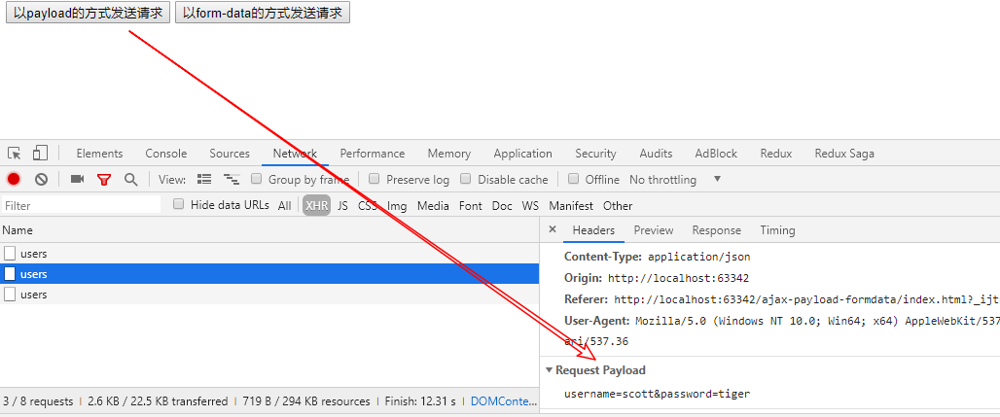
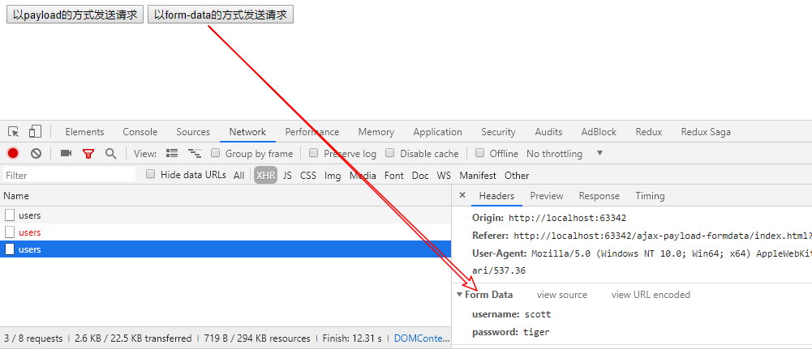
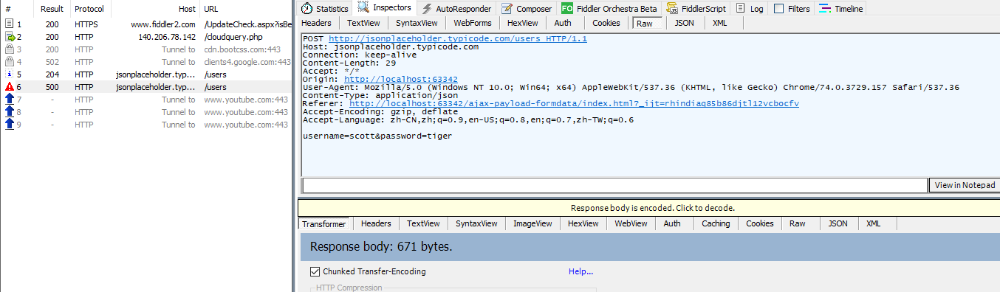
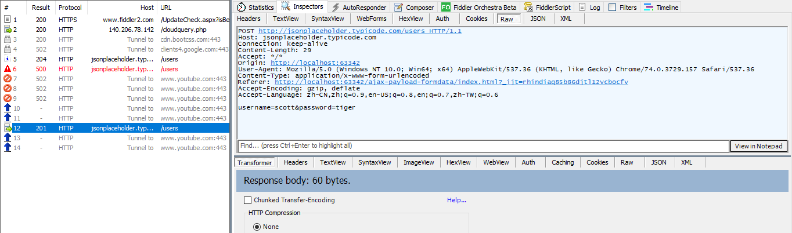
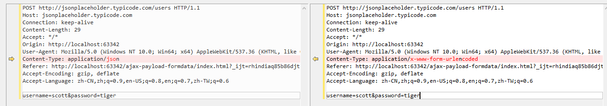

# AJAX请求中payload和formdata两种方式

我们在进行传统的AJAX请求中,都是使用的formdata的方式,简单来说,就是类似于上传一个表单的数据
如注册用户时,我们上传的数据是username和password两个键值对
但是随着时代的发展,前后端交互开始使用json方式进行传输数据,使用formdata的方式来进行传输就感觉有点过时
于是各大厂商开始寻求使用json方式进行传输,由于前后端传输的本质是**字符串**
所以原理上没有太多纠结
下面直接上代码开始展示使用formdata和payload两种方式,以jquery的AJAX为例


```javascript
<!DOCTYPE html>
<html lang="en">
<head>
    <meta charset="UTF-8">
    <title>Title</title>
    <script src="https://cdn.bootcss.com/jquery/3.4.1/jquery.js"></script>
    <script>
        $(function () {
            const url = 'http://jsonplaceholder.typicode.com/users';
            const settings = {
                url,
                type: 'post',
                // 测试数据
                data: {
                    username: 'scott',
                    password: 'tiger',
                },
                success: function (response) {
                    console.log(response);
                }
            }
            $('button#payload').on('click', () => {
                $.ajax(Object.assign(settings, {contentType: 'application/json'}))
            })
            $('button#form-data').on('click', () => {
                $.ajax(Object.assign(settings, {contentType: 'application/x-www-form-urlencoded'}))
            })
        })
    </script>
</head>
<body>
<button id="payload">以payload的方式发送请求</button>
<button id="form-data">以form-data的方式发送请求</button>
</body>
</html>

```

## 截图






## 截获网卡的数据



payload的方式




form-data的方式


比较




目前没有发现显著区别,建议使用payload的方式,后台解析更方便

